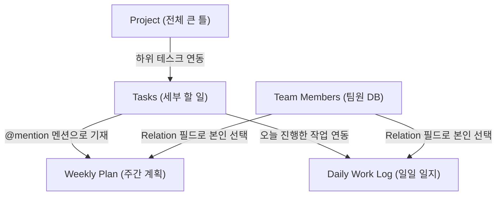

# 🚀 Notion & Slack 주간 업무보고 및 자동 ✅ 마킹 시스템 요구사항 정의서

본 문서는 Notion과 Slack을 연동하여 팀의 주간 실적을 자동으로 대조하고, 계획에 완료 체크(`✅`)를 마킹하며, 미완료 업무 이관과 주간 계획 브리핑을 매주 월요일 아침 출근 전에 자동으로 수행하는 시스템의 명세서입니다.

---

## 📅 1. 팀의 Notion 업무 프로세스 정의

팀원들은 아래와 같이 유기적으로 연결된 Notion 데이터베이스를 활용해 업무를 기록하고 관리합니다.



1. **Project (프로젝트)**: 전체 업무의 가장 큰 틀을 작성합니다.
2. **Tasks (태스크)**: 프로젝트 하위에서 실질적으로 진행되는 개별 할 일 목록입니다.
3. **Weekly Plan (주간 계획)**:
   * **마감 시점**: 매주 월요일 오전 8:30 (출근 전)까지 작성을 완료합니다.
   * **작성 형식**: `2026년 O월 O주차` 형태로 월/주차를 기록하고, `할 일` 필드(리치 텍스트)에 금주에 할 목표를 적으면서 관련 세부 작업 제목을 **Notion 멘션(`@Task`)** 형태로 기재한 뒤, 그 아래에 **세부 불릿 항목**으로 실무 내용들을 나열합니다.
4. **Daily Work Log (일일 업무 일지)**:
   * 매일 수행한 세부 업무들을 기록하며, 관련 `Tasks` 항목 및 본인의 프로필(`Team Members` 관계형 필드)을 선택해 매핑합니다.
   * 각 일지 페이지 내부를 열면 상세한 업무 내용(Paragraph 및 Bulleted List)이 기술되어 있습니다.
5. **Team Members (팀원 DB)**:
   * 노션 기본 User 필드를 사용하는 대신, 별도의 인물 데이터베이스를 만들어 관계형(Relation) 필드로 담당자를 관리합니다.

---

## 🛠️ 2. 핵심 자동화 요구사항 (Core Features)

### 1️⃣ 지난주 실적 대조 및 자동 `✅` 마킹 (Notion Write-Back)
* **목적**: 사람이 일일이 지난주 실적을 점검해서 계획서에 체크하던 번거로움을 완전히 자동화합니다.
* **대조 로직**:
  * 지난주 `Weekly Plan` 내에 기재된 담당자별 세부 불릿 업무(예: `• 센서별 변화 추이 조회`)를 파싱합니다.
  * 지난 일주일(월~일) 동안 해당 담당자가 작성한 `Daily Work Log`들의 **제목 및 본문 상세 내용**을 전부 긁어와 지능적으로 교차 비교합니다.
* **자동 마킹 및 슬랙 하이퍼링크 연동 (이모티콘 제거 및 구조 단순화)**:
  * **Notion 쓰기 연동 시**: 완료된 세부 항목 옆에 노션 API의 Page Mention 객체를 사용해 `✅ (월/일) @[상위 Task명] @[일지명]` 형태로 골뱅이 멘션을 기입하되, 텍스트 상에서 지저분한 문서 모양 `📄` 이모티콘은 중복 방지를 위해 완전히 제외합니다.
  * **Slack 리포트 발송 시**: 골뱅이(`@`) 기호 및 불필요한 `📄` 문서 이모티콘을 깨끗하게 제거하고, 날짜 뒤에 곧바로 슬랙 하이퍼링크 문법 `<Notion_URL|일지명>`을 덧붙여 가독성을 극대화합니다.
  * *슬랙 메시지 예시: `• 센서별 변화 추이 조회 ✅ (5/28) [웹 페이지 API 연동] ➔ <https://notion.so/...|디바이스/센서 상세 정보 모달 실시간 차트 및 스펙 연동>`*

### 2️⃣ 미완료 업무 이관 관리
* **목적**: 지난주 계획 중 달성하지 못한 업무가 유실되지 않도록 보장합니다.
* **동작**:
  * 실적 대조 후 끝까지 `✅` 마크가 붙지 않은 미완료 세부 항목(예: `• Redis 캐싱 전략 수정`)들을 식별합니다.
  * 해당 항목들을 금주 `Weekly Plan`으로 복사-붙여넣기(이관)하여 이어서 진행할 수 있도록 분석 데이터에 적재합니다.

### 3️⃣ 이번 주 계획 종합 브리핑 & Slack 발송
* **목적**: 월요일 출근 전 팀 전체의 실적 및 계획 싱크를 맞춥니다.
* **발송 시점**: **매주 월요일 오전 8:30 이전** (추천: 08:00 ~ 08:15)
* **메시지 핵심 보고 내용 (필수 포함 3대 사안)**:
  1. **[지난주 실제 업무 보고]**: 지난 한 주 동안 각 직원들(`Team Members`)이 `Daily Work Log`에 남긴 실제 상세 업무 수행 내용을 **날짜별로 그룹화(예: '05월 29일 (금요일)' 형식으로만 날짜 표기, '업무 실적' 등의 불필요한 단어는 제거)**하여 브리핑. **(반드시 과거에서 최근 날짜 순서인 '날짜 오름차순'으로 정렬하고, 일지 페이지 본문 내부에 적힌 상세 내용이 있다면 누락 없이 요약 정리하여 보고 포함)**
  2. **[계획 대비 완료/미완료 대조 (표 형식 - 3열 데칼코마니 구조)]**: 지난주 `Weekly Plan`과 지난주 `Daily Work Log`를 비교하여 **계획 대비 완료/미완료 여부를 '표(Table)' 형태로 구성하여 보고**.
     * **표(Table) 칼럼 3열 구성**:
       1. **[1열] O월 O주차 계획**: 계획했던 세부 할 일 목록 (상위 Tasks 페이지 멘션 뒤쪽에 `마감일자`를 `(~6/24)` 형태로 자동 기입 ➔ 하위 세부 계획 불릿 목록 구조).
       2. **[2열] 완료여부**:
          * **대분류 (Tasks 멘션) 행**: 항상 **`-`** 기호로 표기하여 좌우 제목을 시각적으로 연결합니다.
          * **소분류 (세부 불릿) 행**: 완료된 항목은 **`✅`** 기호로 표기하고, 미완료된 항목은 **`❌`** 이모티콘을 배치하여 시각적 직관성을 향상시킵니다.
       3. **[3열] O월 O주차 Daily Work Log (계층 구조 완벽 일치)**: 1열과 완벽하게 데칼코마니 대칭을 이루도록 **상위 Tasks 페이지 멘션 제목을 먼저 적고, 그 아래에 세부 일지 내역을 불릿 형태(`└ • (월/일) 일지명`)로 동일하게 계층화**하여 표기합니다. 단, 미완료된 항목은 지저분한 이관 텍스트 등을 일절 적지 않고 완전히 비워둔 **`공백`** 상태로 처리합니다.
     * **스마트팜 외 업무 예외 처리 규칙**:
       * '스마트팜 외 업무' 프로젝트와 연동된 태스크 및 일지의 경우, 캔버스 본문 보고서에 상세하게 기술하지 않고 본문을 완전히 생략한 채 단 한 줄로만 축약하여 기재(`└ • [스마트팜 외 업무 진행](URL)`)합니다.
     * **구조 정합성**: 1열과 3열이 동일하게 대분류 태스크 페이지 명칭(마감 날짜 포함)으로 시작하고, 세부 실적이 하위 행에 대응되는 완벽한 대칭형 표로 보고합니다. 대분류 제목 행 사이는 `-`로 연결되고, 세부 항목 완료 시 2열에 `✅`, 미완료 시 `❌`가 표시됩니다.
  3. **[이번 주 업무 계획 (독립 분리 보고)]**: 차기 주차인 **이번 주 업무 계획 (예: '6월 1주차 계획')은 대조 표 내부에 섞지 않고, 완전히 별도의 독립된 단락으로 따로 분리하여 보고**합니다. 이전 주에서 넘어온 이관 계획과 이번 주 신규 추진 계획을 일목요연하게 브리핑합니다.
* **주차 타이틀 표기 규칙**: 매주 월요일(예: 6월 1주차)에 작동하지만, 보고의 메인은 지난주의 업무 성과이므로 **리포트 메인 타이틀은 지난주차 기준으로 작성**해야 합니다. (예: 6월 1주차 월요일 가동 시 ➔ `"📅 5월 4주차 주간 업무 브리핑 리포트"`)
* **발송 대상**: 팀원들이 참여 중인 메인 Slack 채널.

---

## 🧪 3. 사전 시뮬레이션 성공 검증 완료 (Proof of Concept)

최현빈 님의 **5월 4주차 실제 데이터**를 바탕으로 모의 테스트를 가동한 결과, **실제 사람의 손으로 체크 마킹한 결과와 100% 동일하게 매칭 분석해 냄이 확인**되었습니다.

### 📈 최현빈 님 5월 4주차 대조 분석 로그 요약
* **`[ 완료 ]` `• 센서별 변화 추이 조회`**
  * ➔ `[2026-05-28] "디바이스/센서 상세 정보 모달 실시간 차트 및 스펙 연동"` 일지와 완벽 매치 **(✅ 자동 부착 대상)**
* **`[ 완료 ]` `• 기상청 API 연동`**
  * ➔ `[2026-05-28] "날씨 정보 시간대 보정 알고리즘 개선 및 익일 예보 시각화"` 일지와 의미론적 연관 매치 **(✅ 자동 부착 대상)**
* **`[미완료]` `• 자동화 카테고리 적용`**
  * ➔ 일지 내 관련 완료 기록 없음 **(미완료 유지 및 금주 이관 대상)**

---

## 📐 4. 아키텍처 및 시스템 구성 계획

시스템은 `/Users/scott/workspace/WorkPlan` 디렉토리에 Node.js 애플리케이션으로 독립 구축됩니다.

```
WorkPlan/
├── package.json           # 의존성 패키지 (@notionhq/client, @slack/web-api, node-cron)
├── .env                   # Notion 및 Slack API 토큰, DB ID 설정 파일
├── test-run.js            # 즉각 수동 테스트 및 강제 마킹 구동 엔진
└── src/
    ├── app.js             # node-cron 기반 월요일 아침 8:00 자동 트리거 엔트리
    └── services/
        ├── notionService.js  # Notion 조회 및 ✅ 쓰기 업데이트 연동
        ├── analyzer.js       # 세부 불릿 텍스트 vs 일일 일지 대조 및 이관 분석기
        └── slackService.js   # 고가독성 Slack Block Kit 메시지 생성 및 발송
```

---

*본 요구사항 명세서를 기점으로 철저하고 엄격하게 시스템 구현을 추진하겠습니다.*
